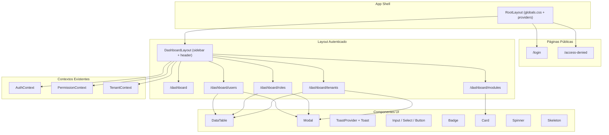

# Documento de Diseño: Diseño UI del Frontend

## Visión General

Este diseño define la arquitectura UI del frontend para la aplicación SaaS multi-tenant. Se implementará sobre Next.js 14 App Router usando CSS Modules con un sistema de design tokens basado en CSS custom properties. No se usarán librerías de UI externas ni Tailwind CSS, manteniendo el proyecto ligero.

La arquitectura se basa en:
- **Design tokens** centralizados como CSS custom properties con soporte dark mode via `prefers-color-scheme`
- **CSS Modules** para estilos con scope por componente
- **Componentes reutilizables** (Table, Modal, Toast, Input, Button, Select, Badge, Card) como building blocks
- **Integración directa** con los contextos existentes (AuthContext, PermissionContext, TenantContext) y HttpClient

## Arquitectura



### Estructura de Archivos

```
apps/frontend/src/
├── app/
│   ├── globals.css                    # Design tokens + reset
│   ├── layout.tsx                     # Root layout (providers)
│   ├── page.tsx                       # Redirect a /dashboard
│   ├── login/
│   │   ├── page.tsx
│   │   └── login.module.css
│   ├── access-denied/
│   │   ├── page.tsx
│   │   └── access-denied.module.css
│   └── dashboard/
│       ├── layout.tsx                 # DashboardLayout (sidebar + header)
│       ├── layout.module.css
│       ├── page.tsx                   # Dashboard home
│       ├── dashboard.module.css
│       ├── users/
│       │   ├── page.tsx
│       │   └── users.module.css
│       ├── roles/
│       │   ├── page.tsx
│       │   └── roles.module.css
│       ├── tenants/
│       │   ├── page.tsx
│       │   └── tenants.module.css
│       └── modules/
│           ├── page.tsx
│           └── modules.module.css
├── components/
│   ├── ui/
│   │   ├── Button.tsx + Button.module.css
│   │   ├── Input.tsx + Input.module.css
│   │   ├── Select.tsx + Select.module.css
│   │   ├── Badge.tsx + Badge.module.css
│   │   ├── Card.tsx + Card.module.css
│   │   ├── DataTable.tsx + DataTable.module.css
│   │   ├── Modal.tsx + Modal.module.css
│   │   ├── Toast.tsx + Toast.module.css
│   │   ├── Spinner.tsx + Spinner.module.css
│   │   └── Skeleton.tsx + Skeleton.module.css
│   ├── guards/                        # (existente)
│   └── TenantSelector.tsx             # (existente, se estilizará)
├── hooks/
│   └── useToast.ts
├── lib/                               # (existente)
└── middleware.ts                       # (existente)
```

## Componentes e Interfaces

### 1. Design Tokens (globals.css)

```css
:root {
  /* Colores */
  --color-bg-primary: #ffffff;
  --color-bg-secondary: #f8f9fa;
  --color-bg-tertiary: #f1f3f5;
  --color-surface: #ffffff;
  --color-border: #e1e4e8;
  --color-text-primary: #1a1a2e;
  --color-text-secondary: #6b7280;
  --color-text-muted: #9ca3af;
  --color-accent: #4f46e5;
  --color-accent-hover: #4338ca;
  --color-accent-light: #eef2ff;
  --color-success: #10b981;
  --color-error: #ef4444;
  --color-warning: #f59e0b;
  --color-info: #3b82f6;

  /* Espaciado */
  --space-xs: 0.25rem;
  --space-sm: 0.5rem;
  --space-md: 1rem;
  --space-lg: 1.5rem;
  --space-xl: 2rem;
  --space-2xl: 3rem;

  /* Tipografía */
  --font-family: -apple-system, BlinkMacSystemFont, 'Segoe UI', Roboto, sans-serif;
  --font-size-xs: 0.75rem;
  --font-size-sm: 0.875rem;
  --font-size-md: 1rem;
  --font-size-lg: 1.125rem;
  --font-size-xl: 1.25rem;
  --font-size-2xl: 1.5rem;
  --font-weight-normal: 400;
  --font-weight-medium: 500;
  --font-weight-semibold: 600;
  --line-height-tight: 1.25;
  --line-height-normal: 1.5;

  /* Bordes */
  --radius-sm: 0.25rem;
  --radius-md: 0.5rem;
  --radius-lg: 0.75rem;

  /* Sombras */
  --shadow-sm: 0 1px 2px rgba(0, 0, 0, 0.05);
  --shadow-md: 0 4px 6px rgba(0, 0, 0, 0.07);
  --shadow-lg: 0 10px 15px rgba(0, 0, 0, 0.1);

  /* Transiciones */
  --transition-fast: 150ms ease;
  --transition-normal: 250ms ease;

  /* Layout */
  --sidebar-width: 16rem;
  --header-height: 3.5rem;
}

@media (prefers-color-scheme: dark) {
  :root {
    --color-bg-primary: #0f172a;
    --color-bg-secondary: #1e293b;
    --color-bg-tertiary: #334155;
    --color-surface: #1e293b;
    --color-border: #334155;
    --color-text-primary: #f1f5f9;
    --color-text-secondary: #94a3b8;
    --color-text-muted: #64748b;
    --color-accent: #818cf8;
    --color-accent-hover: #6366f1;
    --color-accent-light: #1e1b4b;
    --shadow-sm: 0 1px 2px rgba(0, 0, 0, 0.3);
    --shadow-md: 0 4px 6px rgba(0, 0, 0, 0.4);
    --shadow-lg: 0 10px 15px rgba(0, 0, 0, 0.5);
  }
}
```

### 2. Componentes UI Reutilizables

#### Button

```typescript
interface ButtonProps extends React.ButtonHTMLAttributes<HTMLButtonElement> {
  variant?: 'primary' | 'secondary' | 'danger' | 'ghost';
  size?: 'sm' | 'md' | 'lg';
  loading?: boolean;
}
```

Renderiza un `<button>` con estilos según variante. Cuando `loading=true`, muestra un Spinner y deshabilita el botón.

#### Input

```typescript
interface InputProps extends React.InputHTMLAttributes<HTMLInputElement> {
  label?: string;
  error?: string;
}
```

Renderiza un `<input>` con label opcional y mensaje de error. Usa `aria-invalid` y `aria-describedby` para accesibilidad.

#### Select

```typescript
interface SelectOption { value: string; label: string; }
interface SelectProps extends React.SelectHTMLAttributes<HTMLSelectElement> {
  label?: string;
  error?: string;
  options: SelectOption[];
}
```

#### Badge

```typescript
interface BadgeProps {
  variant: 'success' | 'error' | 'warning' | 'info' | 'neutral';
  children: React.ReactNode;
}
```

Mapeo de estados: `active` → success, `inactive` → neutral, `suspended` → error.

#### Card

```typescript
interface CardProps {
  title?: string;
  children: React.ReactNode;
  className?: string;
}
```

#### DataTable

```typescript
interface Column<T> {
  key: string;
  header: string;
  render?: (item: T) => React.ReactNode;
}

interface DataTableProps<T> {
  columns: Column<T>[];
  data: T[];
  actions?: (item: T) => React.ReactNode;
  emptyMessage?: string;
}
```

Renderiza una `<table>` HTML semántica. Cuando `data` está vacío, muestra `emptyMessage`. El contenedor es scrolleable horizontalmente en móvil.

#### Modal

```typescript
interface ModalProps {
  isOpen: boolean;
  onClose: () => void;
  title: string;
  children: React.ReactNode;
  footer?: React.ReactNode;
}
```

Usa `<dialog>` o un div con `role="dialog"` y `aria-modal="true"`. Se cierra con clic en overlay o tecla Escape. Trap de foco dentro del modal.

#### Toast y ToastProvider

```typescript
type ToastVariant = 'success' | 'error' | 'info';

interface Toast {
  id: string;
  message: string;
  variant: ToastVariant;
}

interface ToastContextValue {
  showToast: (message: string, variant: ToastVariant) => void;
}
```

`ToastProvider` envuelve la app y mantiene un array de toasts. Cada toast desaparece automáticamente después de 4 segundos (configurable). Se posicionan en la esquina superior derecha con animación de entrada/salida.

#### Spinner

```typescript
interface SpinnerProps {
  size?: 'sm' | 'md' | 'lg';
}
```

Animación CSS pura con `@keyframes` y `border` circular.

#### Skeleton

```typescript
interface SkeletonProps {
  width?: string;
  height?: string;
  variant?: 'text' | 'rect' | 'circle';
}
```

Animación de pulso CSS para estados de carga.

### 3. Layout Principal (DashboardLayout)

El layout autenticado se implementa como un layout de Next.js en `app/dashboard/layout.tsx`:

```typescript
// Estructura conceptual
function DashboardLayout({ children }) {
  // Usa useAuth() para obtener usuario y logout
  // Usa useTenant() para el selector de tenant
  // Usa usePermissions() + isModuleActive() para filtrar nav items
  
  return (
    <div className={styles.layout}>
      <aside className={styles.sidebar}>
        <nav>
          {navItems.filter(item => !item.module || isModuleActive(item.module)).map(...)}
        </nav>
      </aside>
      <div className={styles.main}>
        <header className={styles.header}>
          {/* TenantSelector, nombre usuario, botón logout */}
        </header>
        <main className={styles.content}>
          {children}
        </main>
      </div>
    </div>
  );
}
```

Navegación condicional por módulo:
| Enlace | Módulo requerido |
|--------|-----------------|
| Dashboard | ninguno |
| Usuarios | `SystemModule.USERS` |
| Roles | `SystemModule.ROLES` |
| Tenants | `SystemModule.TENANTS` |
| Módulos | `SystemModule.MODULE_MANAGEMENT` |

En móvil (<768px): sidebar se oculta y se muestra un botón hamburguesa. Al hacer clic, el sidebar aparece como overlay con backdrop.

### 4. Páginas

#### Login Page
- Formulario centrado con `display: grid; place-items: center; min-height: 100vh`
- Campos: email (type="email"), contraseña (type="password")
- Validación client-side: campos vacíos
- Estado de carga: botón deshabilitado + spinner
- Error del servidor: mensaje debajo del formulario con color `--color-error`
- Tras login exitoso: `router.push('/dashboard')`

#### Dashboard Page
- Grid de Cards con métricas: total usuarios, total roles, módulos activos
- Cada card muestra un número grande y un label
- Datos obtenidos via `httpClient.get('/users')`, `httpClient.get('/roles')`, `httpClient.get('/modules/tenant/:tenantId')`
- Estado de carga: Skeleton en cada card
- Error: Card con mensaje y botón "Reintentar"

#### Users Page
- DataTable con columnas: Email, Nombre, Estado (Badge), Roles, Acciones
- Botón "Crear usuario" (protegido con PermissionGate resource="users" action={Action.CREATE})
- Modal de creación: campos email, contraseña, nombre, apellido
- Modal de edición: campos nombre, apellido, estado (Select)
- Modal de confirmación para eliminar
- Acciones por fila protegidas con PermissionGate

#### Roles Page
- DataTable con columnas: Nombre, Scope (Badge), Permisos (conteo)
- Funcionalidad de asignar rol a usuario via modal con Select de roles

#### Tenants Page
- DataTable con columnas: Nombre, Slug, Estado (Badge), Acciones
- Modal de creación: nombre, slug
- Modal de edición: nombre, estado

#### Modules Page
- Lista de Cards, una por módulo
- Cada card muestra: nombre, descripción, toggle switch
- Módulos core: toggle deshabilitado con indicador visual
- Toggle envía POST /modules/:id/toggle

#### Access Denied Page
- Centrada vertical y horizontalmente
- Icono de candado/escudo (SVG inline)
- Mensaje explicativo
- Botón "Volver al Dashboard"

### 5. Hook useToast

```typescript
function useToast(): ToastContextValue {
  const context = useContext(ToastContext);
  if (!context) throw new Error('useToast must be used within ToastProvider');
  return context;
}
```

## Modelos de Datos

Los modelos de datos ya están definidos en `@core/types`. La UI consume directamente:

| Modelo | Uso en UI |
|--------|-----------|
| `UserDto` | Tabla de usuarios, header (nombre) |
| `RoleDto` | Tabla de roles, selector en asignación |
| `PermissionDto` | Conteo en tabla de roles |
| `TenantDto` | Tabla de tenants, selector de tenant |
| `ModuleDto` | Lista de módulos |
| `TenantModuleDto` | Estado de toggle por tenant |
| `LoginRequest` | Formulario de login |
| `CreateUserRequest` | Modal crear usuario |
| `UpdateUserRequest` | Modal editar usuario |
| `CreateTenantRequest` | Modal crear tenant |
| `UpdateTenantRequest` | Modal editar tenant |
| `AssignRoleRequest` | Modal asignar rol |
| `ToggleModuleRequest` | Toggle de módulo |

No se crean modelos adicionales. Los estados locales de UI (loading, error, modal abierto) se manejan con `useState` de React.


## Propiedades de Correctitud

*Una propiedad es una característica o comportamiento que debe mantenerse verdadero en todas las ejecuciones válidas de un sistema — esencialmente, una declaración formal sobre lo que el sistema debe hacer. Las propiedades sirven como puente entre especificaciones legibles por humanos y garantías de correctitud verificables por máquina.*

Las siguientes propiedades se derivan del análisis de los criterios de aceptación. Se han consolidado propiedades redundantes (por ejemplo, las tablas de usuarios, roles y tenants se validan a través de la propiedad genérica de DataTable).

### Propiedad 1: Validación de campos vacíos/whitespace rechaza envío

*Para cualquier* cadena compuesta enteramente de espacios en blanco (incluyendo cadena vacía) ingresada en un campo requerido de formulario, el formulario no debe enviarse y debe mostrar un mensaje de validación para ese campo.

**Valida: Requisitos 2.5**

### Propiedad 2: Ruta activa resaltada en sidebar

*Para cualquier* ruta del sistema que tenga un enlace correspondiente en el sidebar, el enlace de esa ruta debe tener la clase CSS activa aplicada, y ningún otro enlace debe tenerla.

**Valida: Requisitos 3.5**

### Propiedad 3: Módulos inactivos ocultos en navegación

*Para cualquier* configuración de módulos activos/inactivos de un tenant, el sidebar debe renderizar únicamente los enlaces de navegación cuyos módulos están activos, y ocultar los que están inactivos.

**Valida: Requisitos 3.6**

### Propiedad 4: DataTable renderiza filas y columnas correctamente

*Para cualquier* array de datos y definición de columnas, el DataTable debe renderizar exactamente una fila por elemento del array y exactamente una celda por columna definida en cada fila. Cuando el array está vacío, debe mostrar el mensaje de vacío.

**Valida: Requisitos 10.1, 5.1, 6.1, 7.1**

### Propiedad 5: Modal de edición pre-llenado con datos de la entidad

*Para cualquier* entidad (usuario o tenant), al abrir el modal de edición, los campos del formulario deben contener los valores actuales de esa entidad.

**Valida: Requisitos 5.4, 7.4**

### Propiedad 6: Errores de API generan notificación toast

*Para cualquier* operación de API que falle con un error, el sistema debe mostrar una notificación toast de variante error con el mensaje de error del servidor.

**Valida: Requisitos 5.6, 6.4, 7.5, 8.4**

### Propiedad 7: PermissionGate oculta acciones no autorizadas

*Para cualquier* combinación de permisos de usuario y acciones CRUD, los botones de acción protegidos con PermissionGate deben renderizarse solo cuando el usuario tiene el permiso correspondiente, y no renderizarse cuando no lo tiene.

**Valida: Requisitos 5.7**

### Propiedad 8: Toggle de módulo envía solicitud correcta

*Para cualquier* módulo no-core y cualquier estado de toggle (activo/inactivo), al cambiar el toggle, el sistema debe enviar una solicitud POST /modules/:id/toggle con el moduleId, tenantId y el nuevo valor de isActive invertido respecto al estado actual.

**Valida: Requisitos 8.2**

### Propiedad 9: Módulos core tienen toggle deshabilitado

*Para cualquier* módulo donde isCore es true, el toggle de activación debe estar deshabilitado y no debe permitir interacción del usuario.

**Valida: Requisitos 8.3**

### Propiedad 10: Toggle fallido revierte al estado anterior

*Para cualquier* módulo cuyo toggle falla en la solicitud al servidor, el estado visual del toggle debe revertirse al valor que tenía antes del intento de cambio.

**Valida: Requisitos 8.4**

### Propiedad 11: Modal se cierra con overlay y Escape

*Para cualquier* modal abierto, hacer clic en el overlay o presionar la tecla Escape debe cerrar el modal (isOpen pasa a false).

**Valida: Requisitos 10.2**

### Propiedad 12: Componentes de formulario renderizan estados de error y deshabilitado

*Para cualquier* componente Input, Select o Button con prop `error` definido, el componente debe renderizar el mensaje de error y establecer `aria-invalid="true"`. Con prop `disabled`, el componente debe estar deshabilitado y visualmente indicarlo.

**Valida: Requisitos 10.3**

### Propiedad 13: Toast se auto-descarta después del tiempo configurado

*Para cualquier* toast mostrado con un tiempo de duración configurado, el toast debe desaparecer automáticamente después de transcurrido ese tiempo.

**Valida: Requisitos 10.4**

### Propiedad 14: Badge renderiza variante correcta por estado

*Para cualquier* valor de estado (active, inactive, suspended, etc.), el Badge debe aplicar la clase CSS de variante correspondiente al mapeo definido (active→success, inactive→neutral, suspended→error).

**Valida: Requisitos 10.5**

## Manejo de Errores

| Escenario | Comportamiento |
|-----------|---------------|
| Login con credenciales inválidas | Mensaje de error debajo del formulario, campos no se limpian |
| Token expirado durante operación | HttpClient intenta refresh automático; si falla, redirige a login |
| Error en GET de datos (dashboard, tablas) | Mensaje de error en el área de contenido con botón "Reintentar" |
| Error en POST/PUT/DELETE (CRUD) | Toast de error con mensaje del servidor |
| Error en toggle de módulo | Revertir toggle + toast de error |
| Campos de formulario inválidos | Mensajes de validación inline, no se envía al servidor |
| Ruta sin permisos | Redirección a /access-denied |
| Componente sin contexto requerido | Error de React con mensaje descriptivo (throw en hooks) |

## Estrategia de Testing

### Framework y Herramientas

- **Test runner**: Jest (ya configurado en el proyecto)
- **Testing Library**: @testing-library/react (ya instalado)
- **Property-based testing**: fast-check (ya instalado)
- **Entorno**: jest-environment-jsdom (ya configurado)

### Enfoque Dual

#### Tests Unitarios (ejemplos específicos)
- Renderizado correcto de cada componente UI con props específicos
- Interacciones de usuario: clic en botones, envío de formularios
- Integración con contextos mockeados (AuthContext, PermissionContext)
- Casos edge: listas vacías, errores de red, estados de carga

#### Tests de Propiedades (property-based con fast-check)
- Cada propiedad de correctitud se implementa como un test de propiedad separado
- Mínimo 100 iteraciones por test de propiedad
- Cada test debe referenciar su propiedad del documento de diseño
- Formato de tag: **Feature: frontend-ui-design, Property {N}: {título}**

### Generadores para Property Tests

```typescript
// Generador de datos de usuario
const userDtoArb = fc.record({
  id: fc.uuid(),
  email: fc.emailAddress(),
  firstName: fc.string({ minLength: 1, maxLength: 50 }),
  lastName: fc.string({ minLength: 1, maxLength: 50 }),
  tenantId: fc.uuid(),
  status: fc.constantFrom('active', 'inactive', 'suspended'),
  roles: fc.array(roleArb),
});

// Generador de columnas de tabla
const columnArb = fc.record({
  key: fc.string({ minLength: 1, maxLength: 20 }),
  header: fc.string({ minLength: 1, maxLength: 30 }),
});

// Generador de módulos
const moduleDtoArb = fc.record({
  id: fc.uuid(),
  name: fc.string({ minLength: 1, maxLength: 50 }),
  description: fc.string({ minLength: 0, maxLength: 200 }),
  isCore: fc.boolean(),
});
```

### Cobertura de Propiedades

| Propiedad | Tipo de Test | Generadores |
|-----------|-------------|-------------|
| P1: Validación whitespace | Property | fc.stringOf(fc.constantFrom(' ', '\t', '\n')) |
| P2: Ruta activa | Property | fc.constantFrom(...rutas) |
| P3: Módulos inactivos | Property | fc.array(moduleDtoArb), fc.subarray |
| P4: DataTable filas/columnas | Property | fc.array(fc.object()), columnArb |
| P5: Modal edición pre-llenado | Property | userDtoArb, tenantDtoArb |
| P6: Error API → toast | Property | fc.string() (mensajes de error) |
| P7: PermissionGate | Property | permissionArb, actionArb |
| P8: Toggle envía request | Property | moduleDtoArb, fc.boolean() |
| P9: Core toggle deshabilitado | Property | moduleDtoArb con isCore=true |
| P10: Toggle fallido revierte | Property | moduleDtoArb, fc.boolean() |
| P11: Modal cierra overlay/Escape | Property | fc.boolean() (isOpen) |
| P12: Form error/disabled | Property | fc.option(fc.string()), fc.boolean() |
| P13: Toast auto-descarta | Property | fc.integer({min:1000, max:10000}) |
| P14: Badge variante | Property | fc.constantFrom('active','inactive','suspended') |
