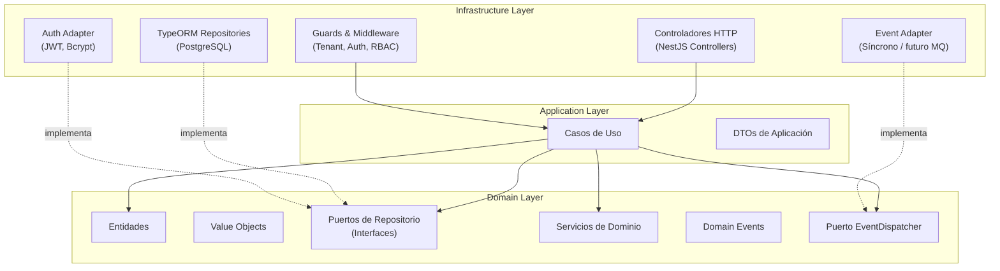
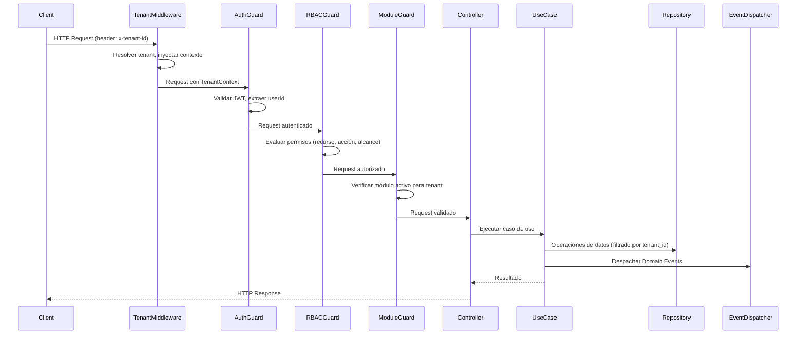
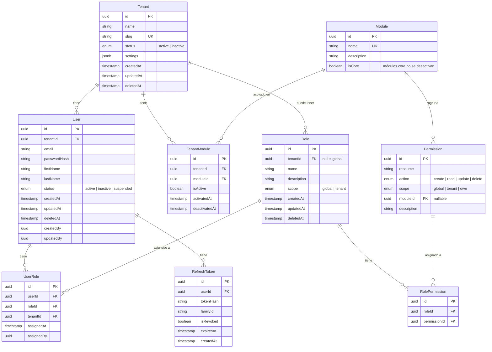

# Documento de Diseño: Core Multi-Tenant SaaS

## Visión General

Este diseño describe la arquitectura del núcleo reutilizable de un sistema SaaS multi-tenant empresarial. Se basa en arquitectura hexagonal (Ports & Adapters) con Domain-Driven Design, separación estricta de capas y preparación para evolucionar a microservicios y arquitectura event-driven.

El sistema se implementa como un monorepo con:
- **Backend**: NestJS + TypeORM + PostgreSQL (arquitectura hexagonal)
- **Frontend**: Next.js (App Router) + Vue 3 (módulos desacoplables)
- **Paquete compartido**: `@core/types` independiente de framework

### Decisiones Técnicas Clave

| Decisión | Justificación |
|----------|---------------|
| Arquitectura Hexagonal | Permite que el dominio sea independiente del framework, facilitando testing y migración a microservicios |
| TypeORM | ORM maduro con soporte nativo para soft deletes, subscribers y decoradores TypeScript |
| JWT + Refresh Token en DB | Balance entre rendimiento (JWT stateless) y seguridad (revocación vía DB) |
| Event Dispatcher síncrono | Simplicidad inicial con puerto reemplazable por message broker (RabbitMQ/Kafka) |
| Monorepo con paquete compartido | Contratos tipados compartidos entre frontend y backend con detección de errores en compilación |
| Aislamiento lógico por tenant_id | Escalable, simple de implementar, migrable a BD por tenant en el futuro |

## Arquitectura

### Diagrama de Capas (Arquitectura Hexagonal)



### Diagrama de Flujo de una Petición



### Estructura de Carpetas

```
/apps/backend/src
  /domain
    /entities              # Entidades de dominio (puras, sin decoradores ORM)
    /value-objects          # Value Objects (Permission, TenantId, etc.)
    /repositories           # Interfaces de repositorio (puertos)
    /services               # Servicios de dominio
    /events                 # Domain Events y puerto EventDispatcher
  /application
    /use-cases              # Casos de uso (un archivo por caso de uso)
    /dto                    # DTOs de aplicación
  /infrastructure
    /database
      /entities             # Entidades TypeORM (decoradas)
      /repositories         # Implementaciones de repositorios
      /migrations           # Migraciones de BD
      /subscribers          # TypeORM subscribers (auditoría)
    /auth                   # Adaptadores de autenticación (JWT, Bcrypt)
    /http
      /controllers          # Controladores NestJS
      /guards               # Guards (Auth, RBAC, Module, Tenant)
      /middleware            # Middleware (TenantContext)
      /decorators            # Decoradores personalizados
    /events                 # Implementación del EventDispatcher
  /modules
    /auth                   # Módulo NestJS de autenticación
    /users                  # Módulo NestJS de usuarios
    /roles                  # Módulo NestJS de roles
    /tenants                # Módulo NestJS de tenants
    /module-management      # Módulo NestJS de gestión de módulos

/apps/frontend
  /src
    /lib
      /api                  # Cliente HTTP tipado
      /auth                 # Lógica de autenticación y refresh
      /permissions           # Sistema reactivo de permisos
      /tenant               # Contexto de tenant
    /components
      /guards               # Componentes de protección (PermissionGate, ModuleGate)
    /app                    # Rutas Next.js (App Router)
    /modules                # Módulos Vue 3 desacoplables

/packages/core-types/src
  /enums                    # Enums (Permission, Action, Scope, Module)
  /dto                      # DTOs compartidos
  /contracts                # Contratos de API (request/response)
  /events                   # Tipos de Domain Events
  /index.ts                 # Barrel export
```

## Componentes e Interfaces

### Capa de Dominio

#### Puertos de Repositorio (Interfaces)

```typescript
// domain/repositories/base.repository.ts
interface IBaseRepository<T> {
  findById(id: string, tenantId: string): Promise<T | null>;
  findAll(tenantId: string, options?: QueryOptions): Promise<T[]>;
  save(entity: T): Promise<T>;
  softDelete(id: string, tenantId: string, deletedBy: string): Promise<void>;
}

// domain/repositories/user.repository.ts
interface IUserRepository extends IBaseRepository<User> {
  findByEmail(email: string, tenantId: string): Promise<User | null>;
  findWithRoles(userId: string, tenantId: string): Promise<User | null>;
}

// domain/repositories/role.repository.ts
interface IRoleRepository extends IBaseRepository<Role> {
  findByName(name: string, tenantId?: string): Promise<Role | null>;
  findWithPermissions(roleId: string): Promise<Role | null>;
}

// domain/repositories/tenant.repository.ts
interface ITenantRepository {
  findById(id: string): Promise<Tenant | null>;
  findBySlug(slug: string): Promise<Tenant | null>;
  save(tenant: Tenant): Promise<Tenant>;
}

// domain/repositories/refresh-token.repository.ts
interface IRefreshTokenRepository {
  save(token: RefreshToken): Promise<RefreshToken>;
  findByToken(tokenHash: string): Promise<RefreshToken | null>;
  revokeByUserId(userId: string): Promise<void>;
  revokeFamily(familyId: string): Promise<void>;
}

// domain/repositories/module.repository.ts
interface IModuleRepository extends IBaseRepository<Module> {
  findActiveByTenant(tenantId: string): Promise<Module[]>;
  isModuleActiveForTenant(moduleId: string, tenantId: string): Promise<boolean>;
}
```

#### Puerto EventDispatcher

```typescript
// domain/events/event-dispatcher.port.ts
interface IEventDispatcher {
  dispatch(event: DomainEvent): Promise<void>;
  register(eventType: string, handler: IEventHandler): void;
}

interface IEventHandler {
  handle(event: DomainEvent): Promise<void>;
}
```

#### Servicios de Dominio

```typescript
// domain/services/permission-evaluator.service.ts
interface IPermissionEvaluator {
  evaluate(
    userPermissions: Permission[],
    requiredResource: string,
    requiredAction: Action,
    context: { tenantId: string; resourceOwnerId?: string; userId: string }
  ): boolean;
}
```

### Capa de Aplicación

#### Casos de Uso

```typescript
// application/use-cases/auth/login.use-case.ts
class LoginUseCase {
  constructor(
    private userRepo: IUserRepository,
    private tokenRepo: IRefreshTokenRepository,
    private hasher: IPasswordHasher,
    private tokenGenerator: ITokenGenerator,
    private eventDispatcher: IEventDispatcher
  ) {}
  execute(dto: LoginDto): Promise<AuthTokensDto>;
}

// application/use-cases/auth/refresh-token.use-case.ts
class RefreshTokenUseCase {
  constructor(
    private tokenRepo: IRefreshTokenRepository,
    private tokenGenerator: ITokenGenerator
  ) {}
  execute(dto: RefreshTokenDto): Promise<AuthTokensDto>;
}

// application/use-cases/users/create-user.use-case.ts
class CreateUserUseCase {
  constructor(
    private userRepo: IUserRepository,
    private hasher: IPasswordHasher,
    private eventDispatcher: IEventDispatcher
  ) {}
  execute(dto: CreateUserDto, context: TenantContext): Promise<UserResponseDto>;
}

// application/use-cases/roles/assign-role.use-case.ts
class AssignRoleUseCase {
  constructor(
    private userRepo: IUserRepository,
    private roleRepo: IRoleRepository,
    private eventDispatcher: IEventDispatcher
  ) {}
  execute(dto: AssignRoleDto, context: TenantContext): Promise<void>;
}

// application/use-cases/modules/toggle-module.use-case.ts
class ToggleModuleUseCase {
  constructor(
    private moduleRepo: IModuleRepository,
    private eventDispatcher: IEventDispatcher
  ) {}
  execute(dto: ToggleModuleDto, context: TenantContext): Promise<void>;
}
```

### Capa de Infraestructura

#### Guards

```typescript
// infrastructure/http/guards/auth.guard.ts
// Valida JWT, extrae userId y tenantId, inyecta en request

// infrastructure/http/guards/rbac.guard.ts
// Lee metadata @RequirePermission del endpoint
// Carga permisos del usuario
// Evalúa usando PermissionEvaluator

// infrastructure/http/guards/module.guard.ts
// Lee metadata @RequireModule del endpoint
// Verifica que el módulo esté activo para el tenant

// infrastructure/http/decorators/require-permission.decorator.ts
// @RequirePermission(resource, action)
// Almacena metadata para el RBACGuard
```

#### Middleware

```typescript
// infrastructure/http/middleware/tenant-context.middleware.ts
// Extrae tenant del header x-tenant-id o del JWT
// Valida que el tenant exista y esté activo
// Inyecta TenantContext en el request
```

### Frontend

#### Cliente HTTP Tipado

```typescript
// frontend/src/lib/api/http-client.ts
class HttpClient {
  // Usa contratos de @core/types
  // Interceptor automático de refresh token
  // Inyecta headers de tenant
  get<T>(url: string, config?: RequestConfig): Promise<T>;
  post<T>(url: string, data: unknown, config?: RequestConfig): Promise<T>;
  put<T>(url: string, data: unknown, config?: RequestConfig): Promise<T>;
  delete<T>(url: string, config?: RequestConfig): Promise<T>;
}
```

#### Sistema Reactivo de Permisos

```typescript
// frontend/src/lib/permissions/permission-context.ts
// React Context que expone:
interface PermissionContext {
  hasPermission(resource: string, action: Action): boolean;
  isModuleActive(moduleId: string): boolean;
  userRoles: Role[];
  currentTenant: Tenant;
}

// frontend/src/components/guards/PermissionGate.tsx
// Componente que renderiza children solo si el usuario tiene el permiso
// <PermissionGate resource="users" action="create">...</PermissionGate>
```


## Modelos de Datos

### Diagrama Entidad-Relación



### Entidades de Dominio (Puras)

```typescript
// domain/entities/base.entity.ts
abstract class BaseEntity {
  id: string;
  createdAt: Date;
  updatedAt: Date;
  deletedAt: Date | null;
}

abstract class AuditableEntity extends BaseEntity {
  createdBy: string;
  updatedBy: string;
}

abstract class TenantAwareEntity extends AuditableEntity {
  tenantId: string;
}

// domain/entities/tenant.entity.ts
class Tenant extends BaseEntity {
  name: string;
  slug: string;
  status: TenantStatus; // 'active' | 'inactive'
  settings: Record<string, unknown>;
}

// domain/entities/user.entity.ts
class User extends TenantAwareEntity {
  email: string;
  passwordHash: string;
  firstName: string;
  lastName: string;
  status: UserStatus; // 'active' | 'inactive' | 'suspended'
  roles: UserRole[];
}

// domain/entities/role.entity.ts
class Role extends BaseEntity {
  tenantId: string | null; // null = global
  name: string;
  description: string;
  scope: RoleScope; // 'global' | 'tenant'
  permissions: RolePermission[];
}

// domain/entities/permission.entity.ts
class Permission {
  id: string;
  resource: string;
  action: Action; // 'create' | 'read' | 'update' | 'delete'
  scope: PermissionScope; // 'global' | 'tenant' | 'own'
  moduleId: string | null;
  description: string;
}

// domain/entities/module.entity.ts
class Module extends BaseEntity {
  name: string;
  description: string;
  isCore: boolean;
}

// domain/entities/refresh-token.entity.ts
class RefreshToken {
  id: string;
  userId: string;
  tokenHash: string;
  familyId: string;
  isRevoked: boolean;
  expiresAt: Date;
  createdAt: Date;
}
```

### Value Objects

```typescript
// domain/value-objects/tenant-id.vo.ts
class TenantId {
  constructor(private readonly value: string) {
    if (!value || !isUUID(value)) throw new InvalidTenantIdError(value);
  }
  getValue(): string { return this.value; }
  equals(other: TenantId): boolean { return this.value === other.value; }
}

// domain/value-objects/email.vo.ts
class Email {
  constructor(private readonly value: string) {
    if (!isValidEmail(value)) throw new InvalidEmailError(value);
  }
  getValue(): string { return this.value; }
  equals(other: Email): boolean { return this.value.toLowerCase() === other.value.toLowerCase(); }
}

// domain/value-objects/permission-spec.vo.ts
class PermissionSpec {
  constructor(
    readonly resource: string,
    readonly action: Action,
    readonly scope: PermissionScope
  ) {}
  matches(required: { resource: string; action: Action }): boolean {
    return this.resource === required.resource && this.action === required.action;
  }
}
```

### Domain Events

```typescript
// domain/events/domain-event.ts
abstract class DomainEvent {
  readonly eventId: string;      // UUID
  readonly occurredAt: Date;
  abstract readonly eventType: string;
  abstract readonly aggregateId: string;
  abstract readonly payload: Record<string, unknown>;

  toJSON(): Record<string, unknown> {
    return {
      eventId: this.eventId,
      eventType: this.eventType,
      occurredAt: this.occurredAt.toISOString(),
      aggregateId: this.aggregateId,
      payload: this.payload,
    };
  }
}

// domain/events/user-created.event.ts
class UserCreatedEvent extends DomainEvent {
  readonly eventType = 'user.created';
  constructor(
    readonly aggregateId: string,
    readonly payload: { userId: string; tenantId: string; email: string }
  ) { super(); }
}

// domain/events/role-assigned.event.ts
class RoleAssignedEvent extends DomainEvent {
  readonly eventType = 'role.assigned';
  constructor(
    readonly aggregateId: string,
    readonly payload: { userId: string; roleId: string; tenantId: string }
  ) { super(); }
}

// domain/events/module-toggled.event.ts
class ModuleToggledEvent extends DomainEvent {
  readonly eventType = 'module.toggled';
  constructor(
    readonly aggregateId: string,
    readonly payload: { moduleId: string; tenantId: string; isActive: boolean }
  ) { super(); }
}
```

### Contratos de API (Core Types)

```typescript
// packages/core-types/src/enums/action.enum.ts
enum Action { CREATE = 'create', READ = 'read', UPDATE = 'update', DELETE = 'delete' }

// packages/core-types/src/enums/scope.enum.ts
enum PermissionScope { GLOBAL = 'global', TENANT = 'tenant', OWN = 'own' }

// packages/core-types/src/enums/module.enum.ts
enum SystemModule { AUTH = 'auth', USERS = 'users', ROLES = 'roles', TENANTS = 'tenants', MODULE_MANAGEMENT = 'module-management' }

// packages/core-types/src/contracts/auth.contracts.ts
interface LoginRequest { email: string; password: string; }
interface LoginResponse { accessToken: string; refreshToken: string; user: UserDto; }
interface RefreshRequest { refreshToken: string; }
interface RefreshResponse { accessToken: string; refreshToken: string; }

// packages/core-types/src/dto/user.dto.ts
interface UserDto { id: string; email: string; firstName: string; lastName: string; tenantId: string; status: string; roles: RoleDto[]; }
interface CreateUserRequest { email: string; password: string; firstName: string; lastName: string; }
interface RoleDto { id: string; name: string; scope: string; permissions: PermissionDto[]; }
interface PermissionDto { resource: string; action: Action; scope: PermissionScope; }

// packages/core-types/src/events/domain-event.types.ts
interface DomainEventPayload { eventId: string; eventType: string; occurredAt: string; aggregateId: string; payload: Record<string, unknown>; }
interface UserCreatedPayload extends DomainEventPayload { payload: { userId: string; tenantId: string; email: string }; }
interface RoleAssignedPayload extends DomainEventPayload { payload: { userId: string; roleId: string; tenantId: string }; }
```


## Propiedades de Correctitud

*Una propiedad es una característica o comportamiento que debe mantenerse verdadero en todas las ejecuciones válidas de un sistema — esencialmente, una declaración formal sobre lo que el sistema debe hacer. Las propiedades sirven como puente entre especificaciones legibles por humanos y garantías de correctitud verificables por máquinas.*

### Propiedad 1: Invariante de tenant_id en entidades

*Para cualquier* entidad tenant-aware creada dentro de un contexto de tenant, el campo tenant_id debe ser no nulo y coincidir con el tenant_id del contexto activo en el momento de la creación.

**Valida: Requisitos 2.3, 2.6**

### Propiedad 2: Aislamiento de datos por tenant en repositorios

*Para cualquier* consulta ejecutada a través de un repositorio con un tenant_id de contexto activo, todos los resultados devueltos deben tener un tenant_id que coincida exactamente con el tenant_id del contexto. Ningún registro de otro tenant debe aparecer en los resultados.

**Valida: Requisitos 2.4, 2.5**

### Propiedad 3: Evaluación de permisos RBAC

*Para cualquier* combinación de permisos de usuario, recurso requerido, acción requerida y contexto (tenantId, userId, resourceOwnerId), el evaluador de permisos debe:
- Conceder acceso si existe un permiso con alcance "global" que coincida en recurso y acción
- Conceder acceso si existe un permiso con alcance "tenant" que coincida en recurso y acción Y el recurso pertenece al mismo tenant que el usuario
- Conceder acceso si existe un permiso con alcance "own" que coincida en recurso y acción Y el userId coincide con el resourceOwnerId
- Denegar acceso en cualquier otro caso

**Valida: Requisitos 3.5, 3.6, 3.7**

### Propiedad 4: Guard de módulo activo

*Para cualquier* petición a un endpoint asociado a un módulo, el guard debe permitir el acceso si y solo si el módulo está activo para el tenant del contexto. Si el módulo está inactivo, la petición debe ser rechazada.

**Valida: Requisitos 4.3, 4.4**

### Propiedad 5: Permisos de módulo inactivo no conceden acceso

*Para cualquier* usuario con permisos vinculados a un módulo que está inactivo para su tenant, esos permisos no deben conceder acceso a ningún recurso del módulo.

**Valida: Requisito 4.6**

### Propiedad 6: Payload del Access Token

*Para cualquier* Access Token generado por el sistema de autenticación, al decodificarlo debe contener los campos userId, tenantId y roles, y estos deben coincidir con los datos del usuario autenticado.

**Valida: Requisito 5.6**

### Propiedad 7: Rotación de Refresh Token

*Para cualquier* operación de refresh, el Refresh Token utilizado debe quedar invalidado (isRevoked = true) y se debe generar un nuevo Refresh Token con un nuevo tokenHash pero el mismo familyId. El token antiguo no debe ser reutilizable.

**Valida: Requisitos 5.2, 5.3**

### Propiedad 8: Revocación por reutilización de Refresh Token

*Para cualquier* Refresh Token que ya ha sido utilizado (isRevoked = true), si se presenta nuevamente, todos los Refresh Tokens de la misma familia (familyId) deben ser revocados.

**Valida: Requisito 5.5**

### Propiedad 9: Credenciales inválidas no revelan información

*Para cualquier* intento de login con credenciales inválidas, ya sea por email inexistente o por contraseña incorrecta, el mensaje de error devuelto debe ser idéntico en ambos casos.

**Valida: Requisito 5.7**

### Propiedad 10: Hashing seguro de contraseñas

*Para cualquier* contraseña almacenada en el sistema, el valor almacenado debe ser un hash bcrypt válido, y verificar la contraseña original contra el hash debe retornar verdadero (round-trip).

**Valida: Requisito 5.8**

### Propiedad 11: Emisión de Domain Events

*Para cualquier* operación de dominio que debe emitir un evento (creación de usuario, asignación de rol, toggle de módulo), el EventDispatcher debe recibir un evento del tipo correcto con aggregateId y payload correspondientes a la operación realizada.

**Valida: Requisitos 6.3, 6.4, 4.5**

### Propiedad 12: Serialización round-trip de Domain Events

*Para cualquier* Domain Event válido, serializarlo a JSON con toJSON() y luego reconstruirlo desde ese JSON debe producir un evento equivalente con los mismos valores de eventId, eventType, occurredAt, aggregateId y payload.

**Valida: Requisito 6.7**

### Propiedad 13: Campos de auditoría en operaciones CRUD

*Para cualquier* entidad auditable:
- Al crearla, createdAt debe ser la fecha actual y createdBy debe ser el userId del contexto
- Al actualizarla, updatedAt debe ser la fecha actual y updatedBy debe ser el userId del contexto

**Valida: Requisitos 7.2, 7.3**

### Propiedad 14: Soft delete y exclusión en consultas

*Para cualquier* entidad eliminada mediante soft delete, el campo deletedAt debe ser no nulo. Las consultas estándar del repositorio no deben incluir registros con deletedAt no nulo, y las consultas con opción de incluir eliminados deben retornarlos.

**Valida: Requisitos 7.4, 7.5**

### Propiedad 15: Interceptor de refresh en frontend

*Para cualquier* petición HTTP que falla con error 401 por token expirado, el interceptor del cliente HTTP debe automáticamente solicitar un nuevo Access Token usando el Refresh Token, y reintentar la petición original con el nuevo token.

**Valida: Requisito 9.2**

### Propiedad 16: Sistema reactivo de permisos en frontend

*Para cualquier* conjunto de permisos de usuario cargados en el contexto, la función hasPermission(resource, action) debe retornar true si y solo si existe un permiso que coincida con el recurso y la acción solicitados.

**Valida: Requisito 9.4**

### Propiedad 17: Renderizado condicional de módulos

*Para cualquier* configuración de módulos activos de un tenant, solo los módulos marcados como activos deben renderizarse en la interfaz. Los módulos inactivos no deben aparecer.

**Valida: Requisito 9.6**

## Manejo de Errores

### Estrategia Centralizada

El sistema implementa un manejo de errores centralizado con las siguientes capas:

#### Errores de Dominio

```typescript
// domain/errors/domain-error.ts
abstract class DomainError extends Error {
  abstract readonly code: string;
  abstract readonly statusCode: number;
}

class EntityNotFoundError extends DomainError {
  code = 'ENTITY_NOT_FOUND';
  statusCode = 404;
  constructor(entity: string, id: string) {
    super(`${entity} con id ${id} no encontrado`);
  }
}

class TenantMismatchError extends DomainError {
  code = 'TENANT_MISMATCH';
  statusCode = 403;
  constructor() {
    super('Acceso denegado: recurso pertenece a otro tenant');
  }
}

class InvalidCredentialsError extends DomainError {
  code = 'INVALID_CREDENTIALS';
  statusCode = 401;
  constructor() {
    super('Credenciales inválidas'); // Mensaje genérico intencional
  }
}

class ModuleInactiveError extends DomainError {
  code = 'MODULE_INACTIVE';
  statusCode = 403;
  constructor(moduleName: string) {
    super(`Módulo ${moduleName} no está activo para este tenant`);
  }
}

class InsufficientPermissionsError extends DomainError {
  code = 'INSUFFICIENT_PERMISSIONS';
  statusCode = 403;
  constructor() {
    super('Permisos insuficientes para esta operación');
  }
}

class TokenExpiredError extends DomainError {
  code = 'TOKEN_EXPIRED';
  statusCode = 401;
}

class TokenReuseDetectedError extends DomainError {
  code = 'TOKEN_REUSE_DETECTED';
  statusCode = 401;
}
```

#### Filtro Global de Excepciones (Infraestructura)

```typescript
// infrastructure/http/filters/global-exception.filter.ts
// Captura todas las excepciones y las transforma en respuestas HTTP estandarizadas
// Formato de respuesta:
interface ErrorResponse {
  statusCode: number;
  code: string;
  message: string;
  timestamp: string;
}
// Los errores de dominio se mapean directamente
// Los errores inesperados se loguean y devuelven 500 genérico
```

### Validación de DTOs

```typescript
// Usar class-validator en DTOs de aplicación
// Pipe global de validación en NestJS
// Errores de validación devuelven 400 con detalle de campos inválidos
```

## Estrategia de Testing

### Enfoque Dual: Tests Unitarios + Tests de Propiedades

El sistema utiliza un enfoque dual de testing:

- **Tests unitarios**: Verifican ejemplos específicos, edge cases y condiciones de error
- **Tests de propiedades (PBT)**: Verifican propiedades universales con inputs generados aleatoriamente

Ambos son complementarios y necesarios para cobertura completa.

### Herramientas

| Herramienta | Uso |
|-------------|-----|
| Jest | Framework de testing principal |
| fast-check | Librería de property-based testing para TypeScript |
| supertest | Testing de endpoints HTTP |
| @nestjs/testing | Utilidades de testing para NestJS |

### Configuración de Property-Based Tests

- Mínimo 100 iteraciones por test de propiedad
- Cada test debe referenciar la propiedad del documento de diseño
- Formato de tag: `Feature: saas-multi-tenant-core, Property {N}: {título}`

### Distribución de Tests

#### Tests de Propiedades (fast-check)

Cada propiedad de correctitud definida en este documento debe implementarse como un test de propiedad individual:

1. **Propiedad 1**: Invariante de tenant_id → Generar entidades aleatorias y verificar tenant_id
2. **Propiedad 2**: Aislamiento por tenant → Generar datos multi-tenant y verificar filtrado
3. **Propiedad 3**: Evaluación RBAC → Generar combinaciones de permisos/recursos/acciones/alcances
4. **Propiedad 4**: Guard de módulo → Generar combinaciones tenant/módulo activo/inactivo
5. **Propiedad 5**: Permisos de módulo inactivo → Generar permisos vinculados a módulos inactivos
6. **Propiedad 6**: Payload Access Token → Generar datos de usuario y verificar token
7. **Propiedad 7**: Rotación Refresh Token → Generar secuencias de refresh y verificar rotación
8. **Propiedad 8**: Revocación por reutilización → Generar escenarios de reuso de tokens
9. **Propiedad 9**: Credenciales inválidas → Generar credenciales incorrectas y verificar mensaje
10. **Propiedad 10**: Hashing bcrypt → Generar contraseñas y verificar round-trip
11. **Propiedad 11**: Emisión de eventos → Generar operaciones y verificar eventos emitidos
12. **Propiedad 12**: Serialización de eventos → Generar eventos y verificar round-trip JSON
13. **Propiedad 13**: Campos de auditoría → Generar operaciones CRUD y verificar campos
14. **Propiedad 14**: Soft delete → Generar eliminaciones y verificar exclusión en consultas
15. **Propiedad 15**: Interceptor refresh → Generar escenarios de token expirado
16. **Propiedad 16**: hasPermission reactivo → Generar conjuntos de permisos y consultas
17. **Propiedad 17**: Renderizado de módulos → Generar configuraciones de módulos

#### Tests Unitarios (Jest)

Los tests unitarios se enfocan en:

- **Ejemplos específicos**: Login exitoso, login fallido, creación de usuario
- **Edge cases**: Tenant inactivo, módulo core no desactivable, refresh token expirado
- **Integración de componentes**: Flujo completo de autenticación, flujo de autorización
- **Condiciones de error**: Entidad no encontrada, validación de DTOs, tokens malformados

### Estructura de Tests

```
/apps/backend/src
  /domain
    /entities/__tests__/       # Tests unitarios de entidades
    /services/__tests__/       # Tests unitarios de servicios de dominio
    /events/__tests__/         # Tests de domain events
  /application
    /use-cases/__tests__/      # Tests de casos de uso
  /infrastructure
    /database/repositories/__tests__/  # Tests de repositorios
    /http/guards/__tests__/    # Tests de guards
  /__tests__/
    /properties/               # Tests de propiedades (fast-check)
```
